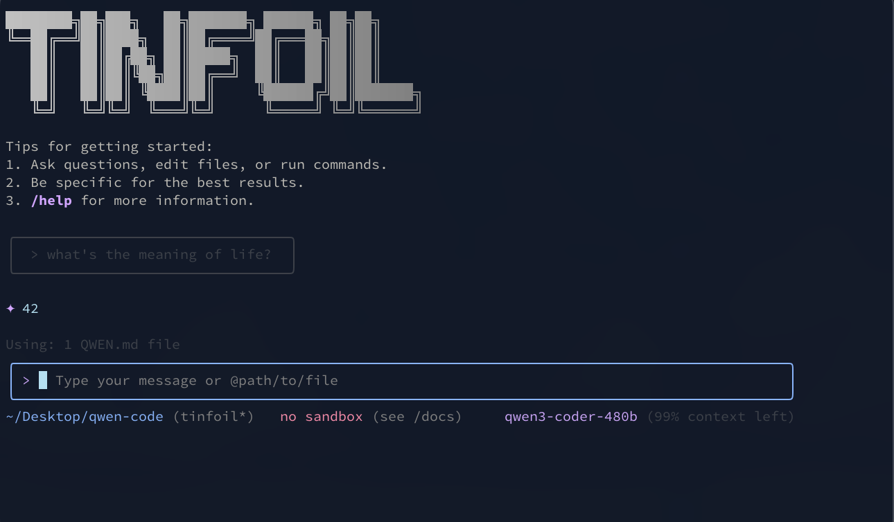

# Tinfoil Code: Qwen Edition

<div align="center">




[](https://www.npmjs.com/package/@tinfoil-code/qwen-code)
[](./LICENSE)
[](https://nodejs.org/)
[](https://www.npmjs.com/package/@tinfoil-code/qwen-code)

**Verifiably Private** AI-powered command-line coding tool

[Installation](#installation) • [Quick Start](#quick-start) • [Features](#key-features) • [Documentation](./docs/) • [Contributing](./CONTRIBUTING.md)

</div>

<div align="center">
  
  <!-- Keep these links. Translations will automatically update with the README. -->
  <a href="https://readme-i18n.com/de/tinfoilsh/qwen-code">Deutsch</a> | 
  <a href="https://readme-i18n.com/es/tinfoilsh/qwen-code">Español</a> | 
  <a href="https://readme-i18n.com/fr/tinfoilsh/qwen-code">français</a> | 
  <a href="https://readme-i18n.com/ja/tinfoilsh/qwen-code">日本語</a> | 
  <a href="https://readme-i18n.com/ko/tinfoilsh/qwen-code">한국어</a> | 
  <a href="https://readme-i18n.com/pt/tinfoilsh/qwen-code">Português</a> | 
  <a href="https://readme-i18n.com/ru/tinfoilsh/qwen-code">Русский</a> | 
  <a href="https://readme-i18n.com/zh/tinfoilsh/qwen-code">中文</a>
  
</div>

Tinfoil Code is a private alternative to the Qwen Code command-line AI coding tool. 

Tinfoil Code is forked from [**Qwen Code**](https://github.com/QwenLM/qwen-code), which was in turn adapted from [**Gemini CLI**](https://github.com/google-gemini/gemini-cli). 

With Tinfoil Code, all AI inference to the Qwen3 Coder model is performed using [Tinfoil](https://tinfoil.sh)'s private AI infrastructure, which provides verifiably private AI inference using secure hardware enclaves. 

**When you use Tinfoil Code, your data remains private and inaccessible to third parties, including Tinfoil and Qwen**


## 💡 Getting Started

Tinfoil Code requires an API key for operation. You'll be prompted to enter your API key on first run. You can get a Tinfoil API key by visiting [https://tinfoil.sh](https://tinfoil.sh).


## Key Features
- **Privacy** - Your queries and code are never exposed to third parties and only processed within isolated secure hardware enclaves. [Learn more about Tinfoil](https://tinfoil.sh/technology). 
- **Code Understanding & Editing** - Query and edit large codebases beyond traditional context window limits
- **Workflow Automation** - Automate operational tasks like handling pull requests and complex rebases
- **Enhanced Parser** - Adapted parser optimized for AI models

## Installation

### Prerequisite: Node.js v20.0.0+

Ensure you have [Node.js version 20](https://nodejs.org/en/download) or higher installed.


### Install from npm

```bash
npm install -g @tinfoil-code/qwen-code@latest
tinfoil-qwen --version
```

### Install from source

```bash
git clone https://github.com/tinfoilsh/qwen-code.git
cd qwen-code
npm install
npm install -g .
```

### Install globally with Homebrew (macOS/Linux)

```bash
brew install qwen-code
```

## Quick Start

```bash
# Start Tinfoil Code
tinfoil-qwen

# Example commands
> Explain this codebase structure
> Help me refactor this function
> Generate unit tests for this module
```

### Session Management

Control your token usage with configurable session limits to optimize costs and performance.

#### Configure Session Token Limit

Create or edit `.tinfoil/settings.json` in your home directory:

```json
{
  "sessionTokenLimit": 32000
}
```

#### Session Commands

- **`/compress`** - Compress conversation history to continue within token limits
- **`/clear`** - Clear all conversation history and start fresh
- **`/stats`** - Check current token usage and limits

> 📝 **Note**: Session token limit applies to a single conversation, not cumulative API calls.

### Authorization

Tinfoil Code requires an API key to function. When you first run `tinfoil-qwen`, you'll be prompted to enter your API key, which will be securely stored for future use.

**Configuration Methods:**

1. **Environment Variables**
   ```bash
   export TINFOIL_API_KEY="your_api_key_here"
   ```

2. **Project `.env` File**
   Create a `.env` file in your project root:
   ```env
   TINFOIL_API_KEY=your_api_key_here
   ```

## Usage Examples

### 🔍 Explore Codebases

```bash
cd your-project/
tinfoil-qwen

# Architecture analysis
> Describe the main pieces of this system's architecture
> What are the key dependencies and how do they interact?
> Find all API endpoints and their authentication methods
```

### 💻 Code Development

```bash
# Refactoring
> Refactor this function to improve readability and performance
> Convert this class to use dependency injection
> Split this large module into smaller, focused components

# Code generation
> Create a REST API endpoint for user management
> Generate unit tests for the authentication module
> Add error handling to all database operations
```

### 🔄 Automate Workflows

```bash
# Git automation
> Analyze git commits from the last 7 days, grouped by feature
> Create a changelog from recent commits
> Find all TODO comments and create GitHub issues

# File operations
> Convert all images in this directory to PNG format
> Rename all test files to follow the *.test.ts pattern
> Find and remove all console.log statements
```

### 🐛 Debugging & Analysis

```bash
# Performance analysis
> Identify performance bottlenecks in this React component
> Find all N+1 query problems in the codebase

# Security audit
> Check for potential SQL injection vulnerabilities
> Find all hardcoded credentials or API keys
```

## Popular Tasks

### 📚 Understand New Codebases

```text
> What are the core business logic components?
> What security mechanisms are in place?
> How does the data flow through the system?
> What are the main design patterns used?
> Generate a dependency graph for this module
```

### 🔨 Code Refactoring & Optimization

```text
> What parts of this module can be optimized?
> Help me refactor this class to follow SOLID principles
> Add proper error handling and logging
> Convert callbacks to async/await pattern
> Implement caching for expensive operations
```

### 📝 Documentation & Testing

```text
> Generate comprehensive JSDoc comments for all public APIs
> Write unit tests with edge cases for this component
> Create API documentation in OpenAPI format
> Add inline comments explaining complex algorithms
> Generate a README for this module
```

### 🚀 Development Acceleration

```text
> Set up a new Express server with authentication
> Create a React component with TypeScript and tests
> Implement a rate limiter middleware
> Add database migrations for new schema
> Configure CI/CD pipeline for this project
```

## Commands & Shortcuts

### Session Commands

- `/help` - Display available commands
- `/clear` - Clear conversation history
- `/compress` - Compress history to save tokens
- `/stats` - Show current session information
- `/exit` or `/quit` - Exit Tinfoil Code

### Keyboard Shortcuts

- `Ctrl+C` - Cancel current operation
- `Ctrl+D` - Exit (on empty line)
- `Up/Down` - Navigate command history

## Benchmark Results

### Performance

For benchmark results and performance metrics, see the original [Qwen Code repository](https://github.com/QwenLM/qwen-code).

## Troubleshooting

If you encounter issues, see the original [Qwen Code repository](https://github.com/QwenLM/qwen-code).


## Acknowledgments

This project is forked from [Qwen Code](https://github.com/QwenLM/qwen-code), which was based on [Google Gemini CLI](https://github.com/google-gemini/gemini-cli). We acknowledge and appreciate the excellent work of both teams.
We tried to keep changes to a minimum with respect to the original Qwen Code repository to be able to more easily maintain this fork.  
